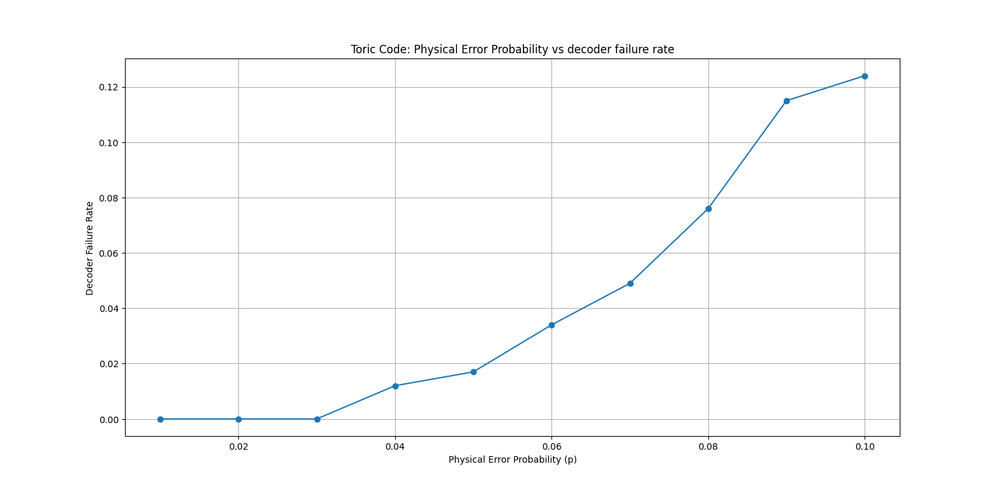
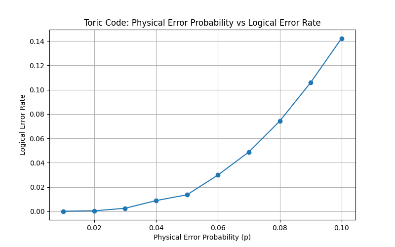

# Toric Code Quantum Error Correction

## Overview

This project implements a numerical simulation of the **Toric Code**, a topological quantum error-correcting code, to study its ability to protect quantum information against physical Pauli errors.

The simulation constructs the Toric Code on a periodic `L × L` lattice, generates random Pauli errors, extracts error syndromes using stabilizer checks, and applies a **Minimum Weight Perfect Matching (MWPM)** decoder to recover the encoded information.

For this project, I use a lattice size of `L = 5`, corresponding to a distance-5 Toric Code with **50 physical qubits and 2 logical qubits**.

## Research Problem

The research problem is to study how effectively the Toric Code protects quantum information against physical Pauli errors and how the decoding process affects the resulting logical error rate.

The simulation evaluates the performance of the code for different physical error probabilities and estimates the resulting logical error rate using Monte Carlo simulations.

## Code Parameters

The simulation uses a `5 × 5` periodic lattice.

* **Lattice size:** `L = 5`
* **Physical qubits:** 50
* **Stabilizer generators:** 50
* **Independent stabilizers:** 48
* **Logical qubits:** 2
* **Code parameters:** `[[50, 2, 5]]`
* **Noise model:** Depolarizing Pauli noise
* **Decoder:** Minimum Weight Perfect Matching (MWPM)

## Methodology

### 1. Toric Code Construction

The Toric Code is constructed on a periodic `L × L` lattice.

Physical qubits are placed on the **edges** of the lattice. Periodic boundary conditions are used so that opposite boundaries are identified, forming a torus.

### 2. Stabilizer Matrices

The `X`-type star stabilizers and `Z`-type plaquette stabilizers are represented using binary parity-check matrices.

The matrices `H_X` and `H_Z` are constructed from the connectivity between physical qubits and stabilizer generators.

The commutation condition

```math
H_X H_Z^T = 0 \pmod 2
```

is verified to ensure that the stabilizer generators commute.

### 3. Pauli Noise Model

Random Pauli errors are generated independently on each physical qubit.

Each qubit experiences:

* `I` with probability `1 − p`
* `X` with probability `p/3`
* `Y` with probability `p/3`
* `Z` with probability `p/3`

where `p` is the physical error probability.

### 4. Syndrome Extraction

The Pauli errors are separated into their `X`- and `Z`-components.

The corresponding stabilizer measurements are used to calculate the error syndrome. The syndrome identifies the locations of stabilizer violations, or **defects**, produced by the physical errors.

### 5. MWPM Decoding

The error syndrome is decoded using a **Minimum Weight Perfect Matching (MWPM)** decoder.

The decoder pairs syndrome defects using minimum-weight paths on the syndrome graph and constructs a correction operator connecting the matched defects.

The `X`- and `Z`-components are decoded separately and then combined to obtain the final Pauli correction.

### 6. Logical Error Detection

After applying the decoder correction, the residual error is checked.

A correction is considered successful when:

1. The residual error has zero syndrome.
2. The residual error does not correspond to a non-trivial logical operator.

A logical error is identified when the residual error has zero syndrome but corresponds to a non-trivial logical operation, detected through its commutation relations with the logical operators.

### 7. Monte Carlo Simulation

Monte Carlo simulations are performed by generating a large number of random Pauli error configurations for different values of the physical error probability `p`.

The simulation records whether each trial results in successful correction, decoder failure, or a logical error.

The logical error rate is then estimated statistically as a function of the physical error probability.

## Validation

The implementation was tested using several validation cases.

* **Single-qubit errors:** 150/150 errors corrected successfully.
* **Two-qubit errors:** 11,025/11,025 errors corrected successfully.
* **Three-qubit errors:** 1,000 random error configurations tested, with 991 successful corrections and 9 logical errors.

The exhaustive single- and two-qubit tests confirm that the distance-5 Toric Code correctly handles the tested error configurations within its guaranteed correction capability.

The three-qubit test demonstrates that the decoder can successfully correct many errors beyond the guaranteed correction radius, although logical failures can occur.

## Results

## Results

The implementation was validated using exhaustive error testing and Monte Carlo simulations for a toric code with code distance `d = 5`, corresponding to a `[[50,2,5]]` quantum error-correcting code.

### Error Correction Validation

- **Single-qubit errors:** 150/150 errors corrected successfully.
- **Two-qubit errors:** 11,025/11,025 errors corrected successfully.
- **Three-qubit errors:** 999/1,000 errors corrected successfully, with 1 logical error.
- **Decoder failures:** No decoder failures were observed in the tested cases.

The exhaustive single- and two-qubit tests confirm that all tested errors of weight up to two were successfully corrected, consistent with the code distance `d = 5`.

### Monte Carlo Simulation

The logical error rate was evaluated for physical error probabilities ranging from `p = 0.01` to `p = 0.10`, using 1,000 trials for each error probability.

The results show that the logical error rate increases as the physical error probability increases.

| **Physical Error Probability** | **Logical Error Rate** |
|---:|---:|
| 0.01 | 0.000 |
| 0.02 | 0.000 |
| 0.03 | 0.003 |
| 0.04 | 0.009 |
| 0.05 | 0.014 |
| 0.06 | 0.030 |
| 0.07 | 0.049 |
| 0.08 | 0.074 |
| 0.09 | 0.106 |
| 0.10 | 0.142 |

### Decoder Failure Rate

The decoder failure rate was also evaluated over the same range of physical error probabilities. No decoder failures were observed in the tested Monte Carlo simulations.

| **Physical Error Probability** | **Decoder Failure Rate** |
|---:|---:|
| 0.01 | 0.000 |
| 0.02 | 0.000 |
| 0.03 | 0.000 |
| 0.04 | 0.000 |
| 0.05 | 0.000 |
| 0.06 | 0.000 |
| 0.07 | 0.000 |
| 0.08 | 0.000 |
| 0.09 | 0.000 |
| 0.10 | 0.000 |

The absence of decoder failures indicates that the observed failures at higher physical error probabilities are logical errors rather than failures of the decoding procedure itself.

### Decoder Failure Rate Plot

The following plot shows the relationship between physical error probability and decoder failure rate.



### Logical Error Rate Plot

The following plot shows the relationship between physical error probability and logical error rate.



## Requirements

The project requires **Python 3** and the following Python packages:

* NumPy
* Matplotlib
* NetworkX

Install the dependencies using:

```bash
pip install -r requirements.txt
```

## How to Run

Clone the repository:

```bash
git clone https://github.com/Prachityagi12/topological-qec.git
```

Navigate to the project directory:

```bash
cd topological-qec
```

Install the required dependencies:

```bash
pip install -r requirements.txt
```

Run the simulation:

```bash
python Toric_Code_L52.py
```

The program constructs the Toric Code, performs validation tests, runs Monte Carlo simulations, and generates the physical error probability versus logical error rate plot.
